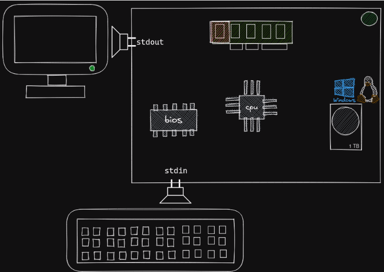

# Input e Output

Um dispositivo computacional (device) possui além de seus componentes internos
duas interfaces virtuais muito importantes quando programamos software de
terminal que são a `stdin` e a `stdout`. De forma bastante simplificada,
podemos dizer que toda vez que precisamos imprimir uma informação na tela, o
processador envia essa informação para o `stdout` e esta interface que se
encarrega de imprimir onde for devido, ex: monitor, terminal, arquivo.
E o mesmo ocorre quando precisamos ler as informações a partir de um
dispositivo de entrada como um teclado, mas neste caso usamos a interface
`stdin`.



### Sys

Em Python existe um módulo chamado sys que fornece utilidades para interagir
com o sistema, uma das utilidades por exemplo é verificar em qual plataforma o
programa está sendo executado:

```python
>>> import sys
>>> print(sys.platform)
'linux'
```

### Python e o Stdout

No módulo `sys` também encontramos o objeto `stdout` que é o responsável por se
comunicar via texto com a respectiva interface.

```python
>>> import sys
>>> sys.stdout
<_io.TextIOWrapper name='<stdout>' mode='w' encoding='utf-8'>
```

Este objeto é um file descriptor e em sistemas Linux por exemplo, tudo é
baseado em descritores de arquivos, nós podemos escrever neste descritor e o
resultado será a impressão da mensagem na tela, repare que este objeto respeita
a tabela de caracteres UTF-8 que nós aprendemos na aula sobre textos.

```python
>>> import sys
>>> quantidade_de_chars = sys.stdout.write("Bruno")
'Bruno'
>>> print(quantidade_de_chars)
5
```

A saída da escrita em um objeto `int` contendo a quantidade de caracteres que
foram impressos com sucesso na saída padrão.

Nós raramente precisaremos usar `sys.stdout` diretamente pois o Python oferece
uma abstração com usabilidade melhor, que é a nossa já conhecida função print.

```python
>>> help(print)
print(value, ..., sep=' ', end='\n', file=sys.stdout, flush=False)
```

Repare que `print` recebe um parâmetro `file` que por padrão é o `sys.stdout`
e faz isso utilizando uma técnica de composição chamada injeção de dependência.

Nós podemos, apenas a título de curiosidade, substituir o argumento `file` por
qualquer outro objeto que seja um file descriptor.

```python
>>> print("Hello", file=open("hello.txt", "a"))
```

No exemplo acima o Python não irá imprimir `Hello` na tela, ao invés disso ele
vai gravar `Hello` em um arquivo chamado `hello.txt` e você pode conferir com o
comando `cat` no Linux.

```bash
$ cat hello.txt
Hello
```

Experimente executar `tail -f hello.txt` em seu terminal Linux, e em outro
terminal executar aquele print que escreve no arquivo, parece mágica mas você
vai ver as mensagens sendo impressas diretamente para dentro do arquivo de
texto.

### Python e o sdtdin

Assim como a saída padrão é o monitor ou terminal, a entrada padrão é sempre o
prompt de comandos e nós assumimos que a entrada será feita através de um
teclado.

A interface para se comunicar com este dispositivo também está no módulo `sys`.

```python
>>> import sys
>>> letras = sys.stdin.read(4)
# Aqui o cursor fica esperando a digitação de 3 caracteres seguidos de enter
ABC<enter>
>>> print(letras)
'\nABC'
```

A boa notícia e que não precisamos usar da forma acima, Python oferece uma
abstração em cima desta interface que é a função `input` que serve para lermos
a entrada a partir da digitação do usuário ou stdin do terminal.

```python
>>> nome = input("Qual o seu nome?\n")
Qual o seu nome?
# O cursor ficará esperando digitarmos algum texto seguido de enter
Bruno<enter>
>>> print(nome)
'Bruno'
```

A função `input` sempre irá ler as informação em formato de texto e seu
argumento único é a mensagem a ser exibida para o usuário.

Uma outra utilidade para a `input` é bloquear a execução do programa até que o
usuário pressione enter.

```python
>>> print("Programa fazendo alguma coisa...")
>>> input("Pressione enter quando quiser continuar...")
# aqui o programa entra em `pausa` e só continua quando o usuário pressionar enter
```

### CLI Arguments

Outra forma de ler informações para dentro de um script é através de argumentos
de CLI quando usamos uma ferramenta de terminal é comum passarmos parâmetros
para dentro do programa, como por exemplo:

```bash
python --version
python -c 'comando'
```

Repare que além do programa `python` passamos os parâmetros `--version` e o
`-c 'comando'`.

Em nossos próprios scripts podemos ler essas informações através do módulo
`sys`.

`programa.py`

```python
import sys
print(sys.argv)

```

No terminal

```bash
$ python programa.py argumento1 argumento2 --nome=Bruno
['programa.py', 'argumento1', 'argumento2', '--nome=Bruno']
```

A lista `sys.argv` irá coletar os argumentos passados para o programa, sendo
que o nome do programa estará sempre na primeira posição, se quisermos
considerar apenas os argumentos passados após o nome do programa podemos fazer
um fatiamento desta lista.

`programa.py`
print(sys.argv[1:]) # começando no elemento 1 (ignorando o 0)

No terminal

```bash
$ python programa.py argumento1 argumento2 --nome=Bruno
['argumento1', 'argumento2', '--nome=Bruno']
```

Cada item da nossa lista de argumentos será um objeto do tipo `str` portanto
podemos usar qualquer operação válida com textos, por exemplo, podemos
transformar os argumentos passados pelo CLI em um dicionário.

`programa.py`

```python
import sys
argumentos = {}
for arg in sys.argv[1:]:
    chave, valor = arg.split("=")
    argumentos[chave.lstrip('-').strip()] = valor.strip()

print(argumentos)
```

Ao executar o programa acima obtemos:

```bash
$ python programa.py --nome=Bruno --idade=15 --cidade=Viana
{'nome': 'Bruno', 'idade': '15', 'cidade': 'Viana'}
```

Em nosso programa podemos usar este dicionário para tomar as decisões de fluxo
do programa.

### Cuidados ao ler inputs.

Assim como as variáveis de ambiente que já aprendemos em nosso primeiro script
tanto os `inputs` quanto `CLI args` sempre serão lidos como texto `str`
portanto pode ser necessário fazer validações e transformações, alguns
exemplos.

```python
# Garantir que não tenha espaços em branco no começo ou final
valor = input("Digite um valor").strip()

# Remover `--` em argumentos de linha de comando
valor = sys.argv[0].lstrip('-')

# Converter texto para número inteiro
valor - int(input("Digite um número").strip())
```

Em todos esses casos ainda precisamos nos preocupar com o tratamento de
`Exceptions`

### Exemplo

```python
#!/usr/bin/env python3
"""Calculadora infix.

Funcionamento:

[operação] [n1] [n2]

Operações:
sum -> +
sub -> -
mul -> *
div -> /

Uso:
$ infixcalc.py sum 5 2
7

$ infixcalc.py mul 10 5
50

$ infixcalc.py
operação: sum
n1: 5
n2: 4
9
"""
__version__ = "0.1.0"

import sys
arguments = sys.argv[1:]


if not arguments:
    operation = input("operação:")
    n1 = input("n1:")
    n2 = input("n2:")
    arguments = [operation, n1, n2]
elif len(arguments) != 3:
    print("Número de argumentos inválidos")
    print("ex: `sum 5 5`")
    sys.exit(1)

operation, *nums = arguments

valid_operations = ("sum", "sub", "mul", 'div')
if operation not in valid_operations:
    print("Operação inválida")
    print(valid_operations)
    sys.exit(1)

validated_nums = []
for num in nums:
    if not num.replace(".", "").isdigit():
        print(f"Numero inválido {num}")
        sys.exit(1)
    if "." in num:
        num = float(num)
    else:
        num = int(num)
    validated_nums.append(num)
    
n1, n2 = validated_nums


if operation == "sum":
    result = n1 + n2
elif operation == "sub":
    result = n1 - n2
elif operation == "mul":
    result = n1 * n2
elif operation == "div":
    result = n1 / n2

print(f"O resultado é {result}")

```