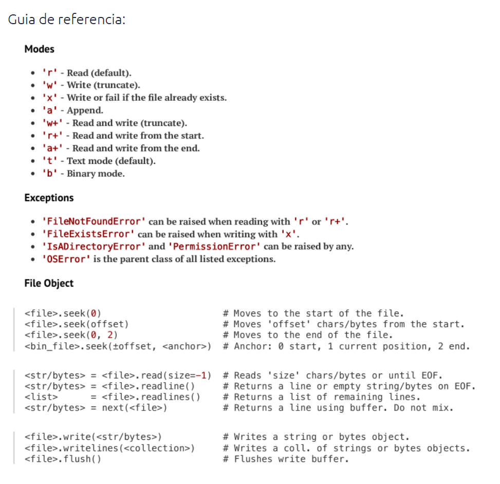

# Interagindo com o sistema de arquivos

### Criar uma pasta

No Linux

```bash
$ mkdir pasta1
```

No Python

```python
>>> import os
>>> os.mkdir("pasta2")
```

### Acessar uma pasta

No linux

```bash
$ cd pasta1
```

No Python

```python
>>> import os
>>> os.chdir("pasta2")
```

### Exibir a pasta atual

No Linux

```bash
$ pwd
/path/pasta1
```

No Python

```python
>>> import os
>>> os.path.abspath(os.curdir)
/path/pasta2
```

### Criar um arquivo em branco

No linux

```bash
$ touch arquivo.txt
```

No Python

```python
>>> open("arquivo.txt", "w")
```

### Listar arquivos

No linux:

```bash
$ ls
arquivo.txt
```

No Python

```python
>>> import os
>>> os.listdir(".")
['arquivo.txt']
```

### Escrever em um arquivo

No Linux

```bash
$ echo "Hello" >> arquivo.txt
```
> **nota** `"w"` escreve no modo `w` substituindo todo o conteúdo do arquivo e 
> `"a"` escreve no modo `a` fazendo append no final do arquivo existente.

### Ler o conteúdo de um arquivo

No Linux

```bash
$ cat arquivo.txt
Hello
```

No Python

```python
>>> print(open("arquivo.txt", "r").read())
'Hello\n'
```

### Dicas úteis ao trabalhar com arquivos no Python
#### Context manager

Nós ainda não falamos sobre este tema, mas para trabalhar com arquivos ele é essencial, no exemplo de escrita em arquivos nós tivemos que chamar a função 
`.close()` explicitamente.

```python
>>> arquivo =  open("arquivo.txt", "a")
>>> arquivo.write("Hello\n")
>>> arquivo.close()
```

Como é muito importante manter os descritores de arquivo devidamente encerrados
em Python sempre ao abrir um arquivo iremos dar preferência para o uso de um context manager, que é um bloco especial de código que automaticamente executa operações como o `.close` em arquivos.

A maneira preferida será sempre:

```python
with open("arquivo.txt", "a") as arquivo:
    # aqui temos o arquivo aberto para escrever
    
    arquivo.write("Hello")

    # aqui o context manager garante o fechamento do arquivo 
    # sem a necessidade de chamarmos explicitamente o .close()
```

#### Criar diretórios não existem em um caminho

```python
>>> os.mkdir("um/outro/maisoutro/)
FileNotFoundError: [Errno 2] No such file or directory: 'um/outro/maisoutro/'
```

Para o código acima funcionar teríamos que criar primeiro `um` e depois `outro` 
e assim por diante, portanto quando temos múltiplas pastas para criar vamos 
preferir usar a função `makedirs`


```python
>>> os.makedirs("um/outro/maisoutro", exist_ok=True)
>>> os.listdir("um")
['outro']
>>> os.listdir("um/outro")
['maisoutro']
```

Ler múltiplas linhas de um arquivo

Um arquivo de texto pode ter milhares de linhas e ao efetuar a leitura com 
`.read` isso pode causar um estouro de memória:

```python
>>> open("arquivo_grande.txt", "r").read()
Error: Not Enough Memory to load 20GB
```

Neste caso devemos usar o procolo de iteração, 
os file descriptors são iteráveis, e melhor que isso eles são geradores de 
dados.

Isso quer dizer que dentro de um loop, a leitura do arquivo linha a linha será mais eficiente:

```python
for linha in open("arquivo_grande.txt", "r"):
    print(linha)
```

Vai imprimir tranquilamente pois mesmo que o arquivo tenha `20GB` será 
carregado para a memória apenas uma linha de cada vez.

Escrever múltiplas linhas em um arquivo

```python
texto = [
    "Este é um texto",
    "cada item desta lista",
    "é uma linha no arquivo",
]

with open("arquivo.txt", "a") as arquivo:
    arquivo.writelines("\n".join(texto))
```

No linux pode ler com:

```bash
$ cat arquivo.txt
Este é um texto
cada item desta lista
é uma linha no arquivo
```

Lendo multiplas linhas de um arquivo

> Lembrando que isso só deve ser feito em arquivos de tamanho pequeno.

```python
>>> open("arquivo.txt").readlines()
['Este é um texto\n', 'cada item desta lista\n', 'é uma linha no arquivo']
```

Trabalhando com caminhos

```python
# Juntando caminhos
>>> import os
>>> os.path.join("pasta2/pasta3/arquivo.txt")
pasta2/pasta3/arquivo.txt

# Obtendo caminho absoluto
>>> os.path.abspath(os.path.join("pasta2/pasta3/arquivo.txt"))
/home/user/pasta2/pasta3/arquivo.txt

# Obtendo o caminho absoluto para o diretorio atual
>>> os.path.abspath(os.curdir)
/tmp/pasta2/foo/
```

### A Pathlib

A pathlib foi adicionada no Python 3 e provê as mesmas funcionalidades do `os` 
e `open` com algumas melhorias de sintaxe.

```python
>>> from pathlib import Path
# Criar pasta
>>> Path("pasta3").mkdir(parents=True, exist_ok=True)
# Criar arquivo na pasta
>>> Path("pasta3/arquivo.txt").touch()
# Escrever no arquivo
>>> Path("pasta3/arquivo.txt").write_text("Bruno")
# Ler o conteúdo do arquivo
>>> Path("pasta3/arquivo.txt").read_text()
'Bruno'
```

Uma característica interessante do objeto `Path` é que ele permite ser 
combinado com outros objetos do mesmo tipo ou `str` usando `/`.

```python
>>> caminho = Path("pasta1") / "pasta2" / Path("pasta3")
>>> print(caminho)
pasta1/pasta2/pasta3
```

### Conclusão

A escolha entre utilizar `os` ou `pathlib` se dá pelo gosto de quem está programando. As funcionalidades são as mesmas e na maioria dos casos as funções executadas serão as mesmas, cabe a quem estiver programando verificar qual das interfaces está lidando na hora de interagir com os objetos file descriptors.



### Exemplo

```python
#!/usr/bin/env python3
"""Bloco de notas

$ notes.py new "Minha Nota"
tag: tech
text: 
Anotacao geral sobre carreira de tecnologia

$ notes.py 1 tech
...
...
"""
__version__ = "0.1.0"

import os
import sys

cmds = ("read", "new")
path = os.curdir
filepath = os.path.join(path, "notes.txt")

arguments = sys.argv[1:]
if not arguments:
    print("Invalid usage")
    print(f"you must specify subcommand {cmds}")
    sys.exit(1)

if arguments[0] not in cmds:
    print(f"Invalid command {argument[0]}")

if arguments[0] == "read":
    # leitura das notas
    for line in open(filepath):
        title, tag, text = line.split("\t")
        if tag.lower() == arguments[1].lower():
            print(f"title: {title}")
            print(f"text: {text}")
            print("-" * 30)
            print()

if arguments[0] == "new":
    title = arguments[1]
    text = [
        f"{title}",
        input("tag:").strip(),
        input("text:\n").strip(),
    ]
    # \t - tsv
    with open(filepath, "a") as file_:
        file_.write("\t".join(text) + "\n")
```