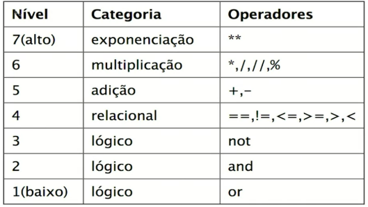

# Tipos de instruções

## Expressões (expressions)

Toda instrução que gera um processamento e espera um valor de retorno.
Expressamos qual operação desejamos que seja computada usando funções ou
operadores matemáticos e sempre esperamos obter um resultado para armazenar em
variáveis ou efetuar operações de comparação.

Exemplos:

```python
# Expressão literal, retorna o próprio número
>>> 1
1

# Expressão, retorna o próprio texto
>>> "Bruno"
'Bruno'

# Expressão de chamada de método ou função
>>> "Bruno".upper()
'BRUNO'

# Expressão com operador, retorna um resultado booleano
>>> 1 > 2
False

>>> 89 >= 89
True

>>> "Bruno" != "Joao"
True

# Chamada de função
>>> sum([1, 2, 3])
6
```

A precedência de operadores no Python.

Além da precedência de operadores aritméticos (PEMDAS), existe a tabela de
precedência de operadores da própria linguagem.



## Declarações (statements)

São formadas por uma ou mais palavras-chave e servem para preparar o
interpretador para efetuar alguma operação. São comandos que alteram estado ou
declaram fluxo lógico.

Algumas palavras-chave que são
statements: `if`, `else`, `elif`, `for`, `while`, `pass`, `def`.

Exemplos:

```python
# Condicional com comparação
if 1 > 2:
    print("Eita, um é maior que 2?")

# Comparação com comparação de igualdade
if x == y:
   # faça isso
else:
   # faça aquilo

# Repetição com comparação de valor
while numero < 10:
    numero += 1
    print(numero)

# Instrução nula
if nao_faca_nada:
    pass
```

Nos exemplos, `if 1 > 2:` temos um statement `if` seguido de uma
expressão `1 > 2`.

## Atribuição (assignment)

É o nome dado à expressão que pega o resultado de uma expressão e salva em uma
variável, atribuindo um nome/identificador ao resultado que pode ser usado como
referência para acesso.

```python
preco = 10
quantidade = 5
total = preco * quantidade
print(f"O total da sua compra é {total}")
```

A atribuição é sempre feita com o sinal de `=`. Do lado esquerdo, definimos um
identificador e do lado direito a expressão a ser atribuída.

No exemplo `total = preco * quantidade`, primeiro o Python resolve a
expressão `10 * 5`, resultando em 50, e então a partir do sinal de `=`,
armazena 50 como valor da variável `total`.
